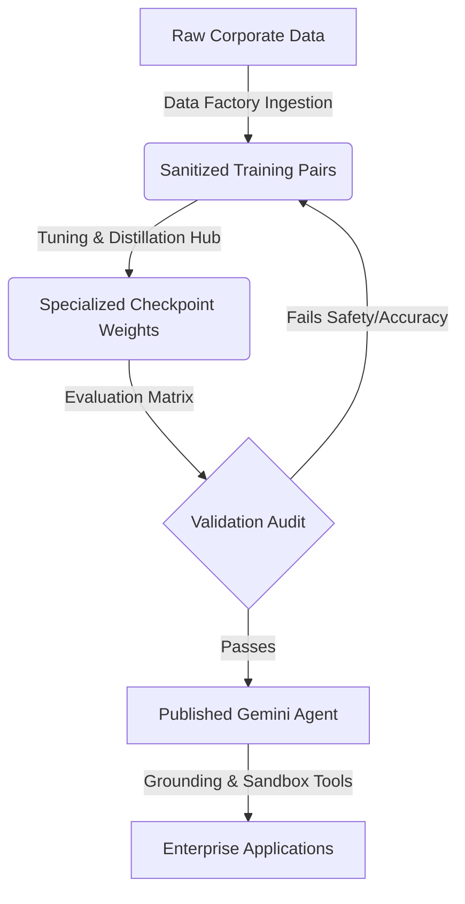

# Executive Briefing: Enterprise LLM Customization Factory
**Author**: Admin Engineer / Model Customization Owner  
**Target Audience**: CxO & Senior Technology Leadership  
**Status**: Ready for Deployment Review  

---

## 🤖 Executive Summary

Enterprise adoption of Generative AI is bottle-necked by three critical challenges: **lack of domain-specific accuracy**, **unpredictable GPU tuning costs**, and **stringent regulatory/data privacy requirements**. 

The **Gemini Enterprise Customization Factory** is a centralized operational tower designed to orchestrate, clean, tune, audit, and publish customized LLM models. Powered by the **Gemini Enterprise Agent Platform**, this factory empowers departments (Finance, Legal, Compliance, Engineering) to safely ingest corporate data, execute low-rank adaptations (LoRA), run automated red-teaming checks, and package specialized checkpoints into production-grade autonomous agents with full compliance tracking.

---

## 💼 Business Value & ROI Projection

| Metric | Baseline (Traditional Customization) | With Customization Factory | Projected Impact |
| :--- | :--- | :--- | :--- |
| **Model Accuracy (Domain)** | 70% – 80% (Generic base output) | **92% – 97%** (Specialized tuning) | **+15-20%** decision quality improvement |
| **GPU Inefficiency / Waste** | High (Unstructured training loops) | **Minimised** (Hyperparameter bounds) | **30% - 40%** training cost reduction |
| **Tuning Iteration Cycle** | Weeks (Manual script writing) | **Hours** (Automated pipeline UI) | **10x** faster time-to-market |
| **Compliance Leakage Risk** | High (No masking / data residency) | **Zero** (Strict PII filters & hosting) | Mitigates regulatory audit penalties |

---

## 🏛️ Key Capabilities & Platform Pillars

### 1. Unified Dataset Factory (Data Ingestion & Cleaning)
*   **Corporate Ingestion**: Drag-and-drop ingestion of standard JSONL, CSV, and TXT documentation.
*   **Pre-tuning Diagnostics**: Automatic compliance checks to mask HIPAA/PII sensitive tokens, prune sequence duplicates, and filter long-tail sequence outliers.
*   **Synthetic Seeding**: Simulated Gemini Synthetic Generator to generate high-fidelity training data based on short text objective prompts.

### 2. High-Efficiency Tuning & Distillation Hub
*   **Parameter Optimization**: Supports **LoRA (Low-Rank Adaptation)** rank constraints, significantly lowering the GPU hardware footprint compared to full parameter tuning.
*   **Knowledge Distillation**: Transfers high-tier capabilities from larger base checkpoints (Gemini 1.5 Pro) into lightweight models (Gemini 1.5 Flash) for cost-efficiency.
*   **Active Job Convergence Tracker**: Real-time canvas telemetry detailing training/validation loss curves and compilation diagnostic logs.

### 3. Safety Auditing & Red-Teaming (Prompt Sandbox)
*   **Prompt Auto-Optimizer**: Iteratively updates system instructions for standard instruction-following guidelines.
*   **Continuous Security Diagnostics**: Scans dialogue threads in real-time to alert developers on jailbreaks, sensitive data leakage, toxicity, and platform policy alignment.

### 4. Evaluation Matrix & Benchmarking
*   **Side-by-Side Execution**: Evaluates response quality, processing latencies, and token expenditures of base reference models vs. tuned checkpoints under identical prompts.
*   **Radar Capability Matrices**: Tests models against preset industry-specific benchmarks (SEC Compliance, NDA Liability Classification, Medical Summarization).

### 5. Secure Agent Packaging & Publisher
*   **Platform Grounding**: Binds custom models to system tools, including **Google Search Grounding**, **Secure Code Interpreter**, and **Custom OpenAPI CRM Connectors**.
*   **Developer Code Exports**: Generates production-ready Python, Node.js, and cURL integration SDK boilerplates.

---

## 🔒 Security, Compliance & Governance Controls

To comply with enterprise security frameworks (ISO 27001, SOC 2, HIPAA, GDPR), the platform implements:
1.  **Strict Data Residency Policies**: Interactive toggles to enforce hosting of model weights inside specific geographical boundaries (e.g. EU-West or Asia-East).
2.  **Clean Data Enforcer**: Global policy rules that block custom tuning runs on datasets that have not undergone validation sanitization checks.
3.  **Immutable Audit Trail**: A complete log capturing all activities (dataset generation, training jobs, API token exports, user actions) coupled with actor identities and IP addresses.

---

## 🗺️ Roadmap & Strategic Next Steps

*   **Phase 1 (Current)**: Local prototype deployment featuring training and evaluation simulators, dataset sanitization panels, prompt red-teaming sandboxes, and static code generation.
*   **Phase 2 (Q3 2026)**: Integration with corporate authentication (OIDC/SAML SSO) and live connection of database connectors to active Google Cloud Platform (GCP) Vertex AI training pools.
*   **Phase 3 (Q4 2026)**: Cross-model federation supporting routing optimizations (directing simple queries to distilled Gemini 1.5 Flash models and complex reasoning queries to specialized Gemini 1.5 Pro instances).
